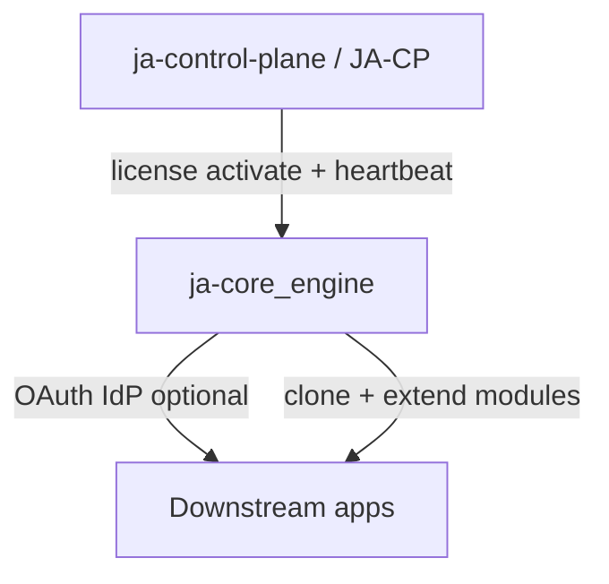

# Architectural Status — `main` vs legacy

Update: 2026-08-22

## Status `main` (canonical kernel)

| Area | Status | Path |
| :--- | :--- | :--- |
| System IAM | **Live** | `backend/Modules/Core/app/System/` |
| Infra (data studio, backup, webhooks) | **Live** | `backend/Modules/Core/app/Infra/` |
| Security (RBAC/ABAC, SIEM, CSP) | **Live** | `backend/Modules/Core/app/Security/` |
| Unified console SPA | **Live** | `frontend/src/modules/Core/` |
| Extension engine | **Live** | Mail manifest + marketplace hooks |
| License → JA-CP | **Live** | `LicenseService`, `license:check` |

## Legacy / tidak ada di `main`

| Area | Asal fork | Catatan |
| :--- | :--- | :--- |
| Content / Publishing / Builder | `ja-cms`, branch `develop` | Referensi di docs lama & CHANGELOG |
| Member portal / platform billing | `ja-control-plane` DNA | E2E & router guards masih ada sisa referensi |
| Theme public site (Janari) | `ja-cms` | Beberapa E2E theme masih ada; tier Content tidak di `main` |
| `Modules/Content/*` scan path | Config legacy | Dihapus dari scan default `main` |

## Integrasi ekosistem

- **JA-CP**: lisensi komersial, bukan runtime kernel.
- **Core Engine**: fondasi; downstream app menambah modul (Content, Operational, …).

## Cleanup backlog (post-fork)

- [x] Docs SoT: AGENT_START_HERE, architectural-status
- [x] Identitas string: JA-CMS → Core Engine (UI + artisan)
- [x] CI smoke: hapus referensi platform billing / payment-env-check
- [ ] Merge atau split `develop` Content tier (keputusan produk)
- [ ] Kurangi E2E CMS-only di `main` atau pindah ke repo downstream
- [ ] PHPStan baseline debt (277 baris)
