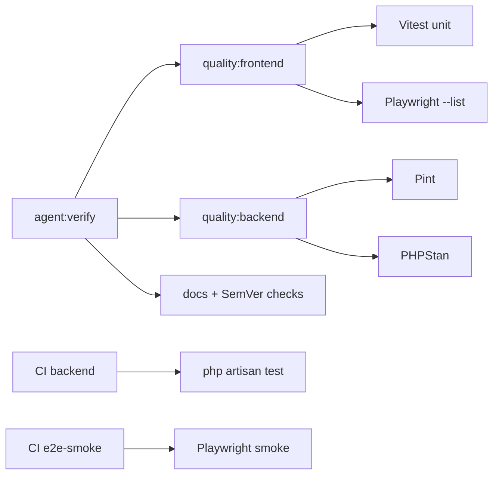

# Reference: Testing & QA suite

Peta lapisan uji di **ja-core_engine**. How-to gate harian: [run-quality-gates.md](../guides/run-quality-gates.md). E2E detail: [run-e2e-playwright.md](../guides/run-e2e-playwright.md).

## Lapisan (jangan dicampur)

| Lapisan | Tool | Lokasi utama | Perintah tipikal |
| :--- | :--- | :--- | :--- |
| Backend automated | Pest + PHPUnit 11 | `backend/tests/`, `backend/Modules/*/tests/` | `npm run test:backend` |
| Backend static | Pint + PHPStan | `backend/` | `npm run quality:backend` |
| Frontend unit | Vitest | `frontend/tests/unit/`, `frontend/tests/components/` | `npm --prefix frontend run test:unit` |
| Frontend static | ESLint, vue-tsc, i18n | `frontend/` | ikut `quality:frontend` |
| E2E | Playwright | `frontend/tests/e2e/` | `npm run test:e2e:smoke` / Docker |
| Runtime smoke | Bash | `scripts/*-smoke*.sh` | butuh stack hidup |
| Load / perf | Bash + node | `scripts/load-test.sh`, `quality:perf` | opsional |
| Docs / SemVer | Node scripts | `docs/`, manifests | `docs:links`, `versions:check`, `modules:versions:check` |



## `agent:verify` vs CI (penting)

| Surface | Isi |
| :--- | :--- |
| **`npm run agent:verify`** (DoD agen lokal) | `quality:frontend` (termasuk **Vitest**) + `quality:backend` (Pint + PHPStan) + `docs:links` + `versions:check` + `modules:versions:check` |
| **Tidak** di `agent:verify` | `php artisan test` (PHPUnit/Pest penuh), Playwright browser smoke, bash API/member smoke |
| **CI `backend`** | `composer run quality` + **`php artisan test`** (matrix PHP) |
| **CI `frontend`** | `quality:frontend` |
| **CI `e2e-smoke`** | Playwright smoke di container resmi (full stack) |
| **CI `docs-links`** | docs links + product/module SemVer |

Sebelum merge yang menyentuh BE runtime: jalankan juga **`npm run test:backend`** (atau andalkan CI). Sebelum merge UX kritis: E2E smoke — lihat [run-e2e-playwright.md](../guides/run-e2e-playwright.md).

## Backend (Pest / PHPUnit)

**Config:** [`backend/phpunit.xml`](../../backend/phpunit.xml) · bootstrap Pest: [`backend/tests/Pest.php`](../../backend/tests/Pest.php)

**Suites:**

| Suite | Path |
| :--- | :--- |
| Unit | `backend/tests/Unit` |
| Feature | `backend/tests/Feature` |
| Modules | `backend/Modules/{Core,Mail,Member,Site,Forms,Publishing,Layout,Media,Library,Newsletter,Analytics,Search,CmsAi}/tests` |

**Perintah (dari root kecuali disebut):**

```bash
npm run test:backend
npm run test:backend:coverage
cd backend && php artisan test --filter=ApiDocsAccessTest
cd backend && composer test
cd backend && composer run test:coverage
cd backend && composer run quality          # Pint --test + PHPStan
cd backend && composer run security:audit  # deps + sandbox test terkait
```

Standar menulis tes: [02-backend-standards.md § Testing](../architecture/02-backend-standards.md).

## Frontend unit (Vitest)

**Config:** `frontend/vite.config.ts` → `test` (happy-dom, setup `frontend/tests/setup/vitest.setup.ts`). E2E **dikecualikan** dari Vitest (`tests/e2e/**`).

```bash
npm --prefix frontend run test:unit
npm --prefix frontend run test:coverage
npm run quality:frontend    # eslint + i18n + type-check + unit + e2e:list
```

Standar: [03-frontend-standards.md § Testing](../architecture/03-frontend-standards.md).

## E2E (Playwright)

Specs: `frontend/tests/e2e/*.spec.ts`.  
Smoke CI/default: `auth-probe-notfound`, `login`, `onboarding-wizard`.

| Script (root atau `frontend/`) | Cakupan |
| :--- | :--- |
| `test:e2e:list` | Inventaris spec (tanpa browser) |
| `test:e2e:smoke` / `test:e2e:ci` | Smoke set |
| `test:e2e:auth` | Auth probe + login |
| `test:e2e:public` | Public site + Layung |
| `test:e2e:member` | Member security |
| `test:e2e:console*` | Appearance / a11y / pagination / modal |
| `test:e2e:cms` | Registry + publishing |
| `test:e2e:smoke:docker` | Smoke di image Microsoft (disarankan di host PVE) |
| `test:e2e:smoke:full` | `PLAYWRIGHT_USE_FULL_STACK=1` + smoke |

How-to lengkap: [run-e2e-playwright.md](../guides/run-e2e-playwright.md).

## Runtime smoke (stack harus hidup)

```bash
bash scripts/api-smoke.sh              # console Sanctum + manage APIs
bash scripts/member-security-qa.sh     # member register/login/logout
```

Prasyarat & checklist: [security-checks.md](../guides/security-checks.md).

## Load / perf (opsional)

```bash
bash scripts/load-test.sh
bash scripts/stepped-load-test.sh
npm --prefix frontend run test:load
npm --prefix frontend run quality:perf   # budget bundle
```

## Coverage

| Target | Command |
| :--- | :--- |
| Backend | `npm run test:backend:coverage` atau `cd backend && composer run test:coverage` |
| Frontend | `npm --prefix frontend run test:coverage` |

Threshold CI penuh tidak di-gate coverage % saat ini — coverage untuk investigasi lokal / PR besar.

## Kapan menjalankan apa

| Situasi | Jalankan |
| :--- | :--- |
| Tutup task agen (DoD) | `npm run agent:verify` |
| Ubah BE controller/service/migration | + `npm run test:backend` (filter bila memungkinkan) |
| Ubah FE logic/store/component | sudah di `quality:frontend`; tambah/ubah Vitest |
| Ubah login/onboarding/shell kritis | E2E smoke (Docker bila perlu) |
| Ubah auth member / API publik | `member-security-qa.sh` / `api-smoke.sh` |
| Docs / SemVer saja | `docs:links` (+ version checks ikut verify) |

## Related

- CLI cheat sheet: [cli-commands.md](cli-commands.md)
- Quality gates: [run-quality-gates.md](../guides/run-quality-gates.md)
- Security smoke: [security-checks.md](../guides/security-checks.md)
- HTTP/OpenAPI: [http-api.md](http-api.md)
